<!--
  f73tu99-design — GitHub profile README
  ────────────────────────────────────────────────────────────────────────
  The panels under assets/ are hand-authored animated SVGs. GitHub strips
  <style> and <script> from README HTML, but an SVG loaded through 
  renders as its own document, so the CSS animations inside each file run
  normally. That is the whole trick — there is no JavaScript here.

  stats.svg, languages.svg, activity.svg, snake.svg and snake-dark.svg are
  REGENERATED by .github/workflows/profile-metrics.yml. Do not hand-edit
  them; your changes will be overwritten on the next run.

  Everything else is yours to edit freely.
-->

  

 

  

 

  

 

  

 

  
  

 

  

 

  <picture>
    <source media="(prefers-color-scheme: dark)" srcset="./assets/snake-dark.svg" />
    <source media="(prefers-color-scheme: light)" srcset="./assets/snake.svg" />
    
  </picture>

 

<!-- EDIT: swap the placeholder URLs below for your real ones, or delete the badge. -->

 

  

